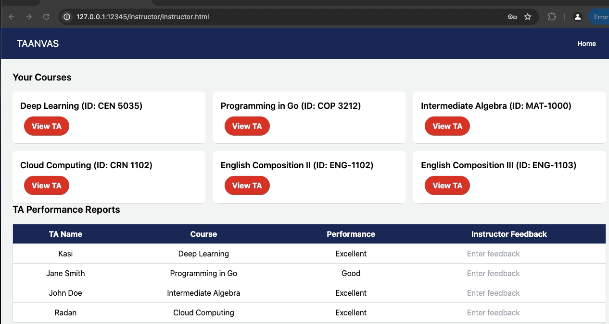

# 🎨 Taanvas

Welcome to **Taanvas**, a collaborative project for the CEN5035 Software Engineering class! This project is designed to streamline the TA application process, making it easier for department staff, committees, instructors, and applicants to interact with the system.

## 🚀 Quick Start

1. **Install Express with Node:**
   ```bash
   npm install express
   ```

2. **Start the Development Server:**
   ```bash
   node server.js
   ```

## 🌟 Features

1. **Home Page:**
   - Explore the TA Application System's intuitive home page designed for easy navigation and access to all user types. 🏠

   

2. **Department Staff Interface:**
   - Experience the tailored department staff interface offering course management tools and efficient TA application processing. 🏢

   

3. **Committee View:**
   - Discover the comprehensive committee view providing decision-making capabilities for optimizing TA selection. 🧑‍💼

   

4. **TA Applicant Portal:**
   - Navigate the TA applicant portal to submit applications and view application status updates. 📄

   

5. **Instructor Portal:**
   - Utilize the instructor portal to manage TA performance and view course details. 👨‍🏫

   

## 🤝 Contributing

We welcome contributions! Please feel free to submit a pull request or open an issue to improve the project.

Thank you for visiting Taanvas! We hope you enjoy using the system as much as we enjoyed building it. 🎉
